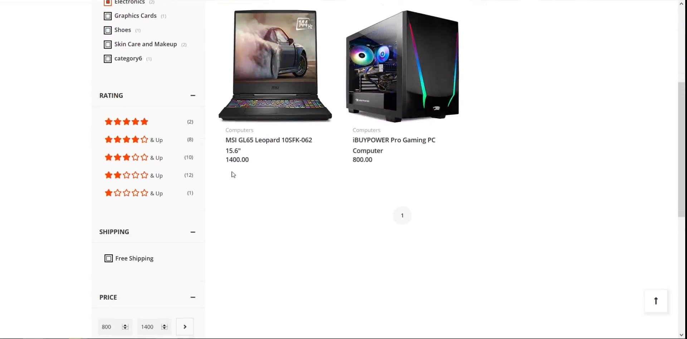

# ITI_Ecommerce_Website

An Ecommerce website as a project for [ITI](iti.gov.eg/), made to be a full online shopping solution supporting all basic functionalities like an advanced product filtering, cart, wishlist, a personalized home page, and complete support for non-logged in users plus they can signup to claim the account.

## Methodologies

Java, MySql, servlet, JSP, JSTL, JPA, JQuery, AJAX, SSE, and WebSocket 

## Credits

We started from this template and made it into the full functional Ecommerce website it is now.

Team members:
- [Mohamed Osman  (Id: 1)](https://github.com/Osman969)
- [Dalia Elzohairy  (Id: 11)](https://github.com/DaliaElzohairy96)
- [Mohammed Hassan  (Id: 15)](https://github.com/mhbughdadi)
- [Hadeer Elnaggar  (Id: 100)](https://github.com/hadeerelnaggar)
- [MKSherbini  (Id: 666)](https://github.com/MKSherbini)

## Target Platform

The main target platform is Web.

## Release

You can access the site from anywhere using links [here](15.188.55.103:1919/ITI_Ecommerce_Website), ludus-itiwebsite.ddns.net, and ludus-iti.ddns.net.net.

## Video Demo

## Website ScreenShots

